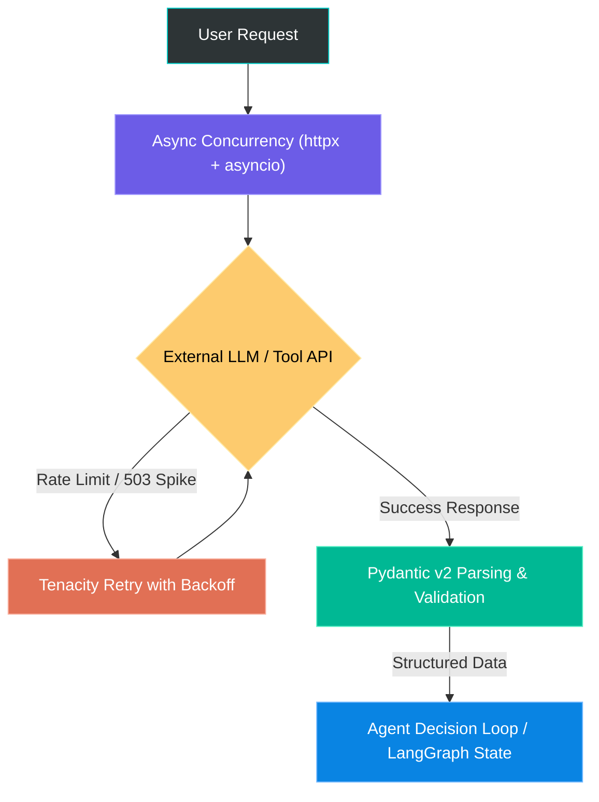

# 🎓 Phase 1: Python + AI Foundations — Complete Masterclass

Welcome to **Phase 1** of your AI Engineer roadmap!

If you want to land a high-paying job as an **AI Engineer**, the most important thing to understand on Day 1 is this:
> **An AI Engineer is NOT just someone who writes prompts.**  
> An AI Engineer is a software engineer who builds **reliable, production-grade systems** around non-deterministic AI models (LLMs).

Because LLMs can hallucinate, experience high network latency (3 to 15 seconds per call), and hit rate limits, your Python foundation must be bulletproof. In this phase, you will master the exact four Python pillars that every AI framework (**LangChain, LangGraph, LlamaIndex, CrewAI, FastAPI**) relies upon.

---

## 📑 Table of Contents
1. [How to Run and Test This Project by Yourself](#-how-to-run-and-test-this-project-by-yourself)
2. [The 4 Core Pillars of Python in AI](#-the-4-core-pillars-of-python-in-ai)
   - [Pillar 1: Asynchronous Programming (Async/Await)](#pillar-1-asynchronous-programming-asyncawait)
   - [Pillar 2: Pydantic v2 & JSON Schema for LLMs](#pillar-2-pydantic-v2--json-schema-for-llms)
   - [Pillar 3: Rate Limiting & Concurrency Control](#pillar-3-rate-limiting--concurrency-control)
   - [Pillar 4: Resilience & Exponential Backoff](#pillar-4-resilience--exponential-backoff)
3. [Deep Code Walkthrough (How Every File Works)](#-deep-code-walkthrough)
   - [models.py — The Data Contracts](#1-modelspy--the-data-contracts)
   - [api_client.py — The Async Engine](#2-api_clientpy--the-async-engine)
   - [main.py — The Interactive CLI](#3-mainpy--the-interactive-cli)
   - [test_project.py — The Automated Quality Assurance](#4-test_projectpy--the-automated-quality-assurance)
4. [Hands-On Experiments: Break and Learn](#-hands-on-experiments-break-and-learn)
5. [Interview Prep: 5 Core Questions You Must Know](#-interview-prep-5-core-questions-you-must-know)

---

## 💻 How to Run and Test This Project by Yourself

Follow these exact steps in your Mac terminal.

### Step 1: Open Terminal in the Project Directory
Make sure your terminal is inside the root folder:
```bash
cd "/Users/jashan/Desktop/AI Engenier"
```

### Step 2: Activate Your Virtual Environment
We created a virtual environment (`.venv`) powered by Homebrew's Python 3.12. Activate it:
```bash
source .venv/bin/activate
```
> [!NOTE]
> When active, your terminal prompt will show `(.venv)` on the left. This ensures you are using the isolated Python 3.12 environment with all necessary packages installed.

### Step 3: Run the Interactive Demo
Navigate to the project folder and launch the CLI:
```bash
cd 01-python-ai-foundations/project
python main.py
```

**What you will see on your screen:**
1. **Banner**: Confirmation of Python 3.12 environment.
2. **Concurrent API Table**: Live weather data fetched in parallel for 5 global cities (London, Tokyo, New York, San Francisco, Sydney) with response latencies.
3. **Pydantic Validation Demonstration**: How Pydantic catches bad data before it crashes your app.
4. **LLM Function Schema**: The exact JSON schema that OpenAI and Anthropic require to execute tools.
5. **Real-time Token Streaming**: Live text generation with token counting and calculated USD cost.

### Step 4: Run the Automated Unit Tests
To verify every function, validation rule, and async call automatically, run:
```bash
pytest test_project.py -v
```
You should see all **9 tests pass with green checks** (`PASSED`).

---

## 🧠 The 4 Core Pillars of Python in AI



### Pillar 1: Asynchronous Programming (Async/Await)

#### The Problem
In normal (synchronous) Python:
```python
import time
import requests

# Each call blocks the entire CPU thread for 2 seconds
requests.get("https://api.openai.com/...") # waits 2s
requests.get("https://api.openai.com/...") # waits 2s
requests.get("https://api.openai.com/...") # waits 2s
# Total time: 6 seconds!
```
If you have 100 users asking questions, your server will freeze.

#### The Solution: The Event Loop
In asynchronous Python (`asyncio`):
```python
import asyncio
import httpx

async def call_api():
    async with httpx.AsyncClient() as client:
        await client.get("https://api.openai.com/...")

# Run all 3 concurrently
await asyncio.gather(call_api(), call_api(), call_api())
# Total time: ~2 seconds total!
```

**Real-world Analogy**:  
Think of a waiter in a restaurant.
- **Synchronous waiter**: Takes Order #1 to the kitchen, stands there doing nothing for 15 minutes waiting for the chef to cook, delivers Order #1, and only *then* takes Order #2.
- **Asynchronous waiter**: Takes Order #1 to the kitchen, immediately goes to Table 2 while Chef #1 is cooking, takes Order #2, and delivers whichever dish is ready first.

---

### Pillar 2: Pydantic v2 & JSON Schema for LLMs

#### Why LLMs Need Pydantic
LLMs output strings of text. But code cannot safely use random text.
If you ask an LLM:
> *"Extract the user's location and preferred units."*

The LLM might say:
> *"Sure! The user lives in San Francisco and prefers Celsius."*

How do you save that into a database or pass it to an API? You can't! You need:
```json
{
  "location": "San Francisco",
  "unit": "celsius"
}
```

#### How Pydantic Solves This
Pydantic lets you define a strict class:
```python
from pydantic import BaseModel, Field
from typing import Literal

class UserPreferences(BaseModel):
    location: str = Field(..., description="The city name")
    unit: Literal["celsius", "fahrenheit"] = Field(default="celsius")
```

When you pass `UserPreferences.model_json_schema()` to OpenAI or Anthropic, the LLM is **forced** to output valid JSON matching that exact schema. Pydantic then parses and validates it automatically!

---

### Pillar 3: Rate Limiting & Concurrency Control

When working with APIs like OpenAI, Anthropic, or external search tools, you are bound by **Rate Limits**:
- **RPM** (Requests Per Minute): e.g., max 60 requests per minute.
- **TPM** (Tokens Per Minute): e.g., max 100,000 tokens per minute.

If you send 20 requests at the exact same millisecond with `asyncio.gather()`, the server responds with **HTTP 429 Too Many Requests**.

#### The Fix: `asyncio.Semaphore`
A `Semaphore` acts like a bouncer at a club. If you set `asyncio.Semaphore(3)`, only 3 requests are allowed inside at any given time. As soon as one finishes, the next one is admitted.

```python
sem = asyncio.Semaphore(3)

async def safe_fetch(url):
    async with sem: # Bouncer allows max 3
        return await client.get(url)
```

---

### Pillar 4: Resilience & Exponential Backoff

APIs on the internet fail constantly. In AI engineering, you will see:
- **HTTP 429**: Rate limit reached.
- **HTTP 502 / 503**: Model server overloaded.
- **ReadTimeout**: LLM took too long to generate tokens.

If you fail immediately, your app crashes. If you retry immediately, you make the server overload worse!

#### The Fix: Exponential Backoff with `tenacity`
Instead of retrying immediately, you wait exponentially longer after each failure:
- **Attempt 1 fails** -> Wait 0.5 seconds -> Retry
- **Attempt 2 fails** -> Wait 1.0 seconds -> Retry
- **Attempt 3 fails** -> Wait 2.0 seconds -> Retry
- **Attempt 4 fails** -> Wait 4.0 seconds -> Final Attempt

In Python, we use the `tenacity` library:
```python
from tenacity import retry, stop_after_attempt, wait_exponential

@retry(stop=stop_after_attempt(3), wait=wait_exponential(multiplier=0.5, min=0.5, max=4.0))
async def resilient_call():
    # Will automatically retry up to 3 times before giving up!
    return await client.get("...")
```

---

## 🔍 Deep Code Walkthrough

Let's examine how each file in `01-python-ai-foundations/project/` works.

### 1. `models.py` — The Data Contracts

Open [models.py](file:///Users/jashan/Desktop/AI%20Engenier/01-python-ai-foundations/project/models.py).

#### A. GeoLocation Model
```python
class GeoLocation(BaseModel):
    city_name: str = Field(..., min_length=1, max_length=100, description="Name of the city")
    country: str = Field(..., min_length=2, max_length=100, description="Country name")
    latitude: float = Field(..., ge=-90.0, le=90.0, description="Latitude from -90 to 90 degrees")
    longitude: float = Field(..., ge=-180.0, le=180.0, description="Longitude from -180 to 180 degrees")
    timezone: str = Field(default="UTC", description="IANA Timezone string")

    @field_validator("city_name", "country")
    @classmethod
    def strip_whitespace(cls, value: str) -> str:
        return value.strip()
```
- `ge=-90.0, le=90.0`: Guarantees latitude cannot be an impossible value like `150.0`.
- `@field_validator("city_name", "country")`: Automatically strips leading/trailing spaces (`"  Tokyo  "` becomes `"Tokyo"`).

#### B. Dynamic Tool Definition for LLMs
```python
class ToolDefinition(BaseModel):
    name: str
    description: str
    parameters: dict

    @classmethod
    def from_pydantic_model(cls, name: str, description: str, model_cls: type[BaseModel]):
        return cls(
            name=name,
            description=description,
            parameters=model_cls.model_json_schema()
        )
```
- `model_cls.model_json_schema()`: This is the magic method! It inspects your Pydantic model and generates the exact JSON schema that OpenAI / Anthropic expect for tool calling.

---

### 2. `api_client.py` — The Async Engine

Open [api_client.py](file:///Users/jashan/Desktop/AI%20Engenier/01-python-ai-foundations/project/api_client.py).

#### A. The Async Context Manager
```python
class ResilientAIClient:
    async def __aenter__(self):
        self._client = httpx.AsyncClient(timeout=self.timeout, limits=self.limits)
        return self

    async def __aexit__(self, exc_type, exc_val, exc_tb):
        if self._client:
            await self._client.aclose()
```
- Using `async with ResilientAIClient() as client:` ensures that underlying TCP connection pools are opened cleanly and closed immediately when finished, preventing memory and socket leaks.

#### B. The Batch Fetching Engine
```python
async def get_weather_batch(self, cities: List[str]):
    tasks = [self.get_weather_report(city) for city in cities]
    results = await asyncio.gather(*tasks)
    return list(results)
```
- `asyncio.gather(*tasks)` launches all city requests in parallel! While London is resolving, Tokyo is already downloading its weather.

---

### 3. `main.py` — The Interactive CLI

Open [main.py](file:///Users/jashan/Desktop/AI%20Engenier/01-python-ai-foundations/project/main.py).

It ties all components together into 4 visual demonstrations:
1. `demo_concurrent_api()`: Calls `client.get_weather_batch()` and renders a styled table with `rich`.
2. `demo_pydantic_validation()`: Passes intentionally invalid data to show how Pydantic protects the system.
3. `demo_tool_calling_schema()`: Prints formatted JSON schema for an AI tool.
4. `demo_token_streaming()`: Simulates streaming tokens one by one with live cost calculations.

---

### 4. `test_project.py` — The Automated Quality Assurance

Open [test_project.py](file:///Users/jashan/Desktop/AI%20Engenier/01-python-ai-foundations/project/test_project.py).

As an AI engineer, automated tests are your safety net. In this file:
- `test_geo_location_invalid_latitude()`: Uses `pytest.raises(ValidationError)` to ensure invalid coordinates fail predictably.
- `test_chat_message_tool_validator()`: Ensures a tool message cannot exist without a tool name.
- `test_token_cost_calculation()`: Verifies that token pricing mathematics are accurate down to the micro-cent.
- `test_real_geocoding_and_weather()`: End-to-end integration test with live APIs.

---

## 🧪 Hands-On Experiments: Break and Learn

To truly master this, try these 3 quick experiments right now in your editor!

### Experiment 1: Trigger a Validation Error
1. Open [main.py](file:///Users/jashan/Desktop/AI%20Engenier/01-python-ai-foundations/project/main.py#L90-L100).
2. Change the valid location in line 96 from:
   ```python
   latitude=52.52
   ```
   to:
   ```python
   latitude=999.0
   ```
3. Run `python main.py` in your terminal.
4. **Observe**: Pydantic immediately rejects it with: `Input should be less than or equal to 90`. Revert it back when done.

### Experiment 2: Compare Parallel vs Sequential Speed
1. Open [main.py](file:///Users/jashan/Desktop/AI%20Engenier/01-python-ai-foundations/project/main.py#L40).
2. Change `max_concurrent=3` to `max_concurrent=1`.
3. Run `python main.py`.
4. **Observe**: Notice how the total execution time jumps because only 1 city is fetched at a time!

### Experiment 3: Inspect the Tool Schema
1. In your terminal, run:
   ```bash
   python -c "from models import GeoLocation; import json; print(json.dumps(GeoLocation.model_json_schema(), indent=2))"
   ```
2. **Observe**: This JSON structure is what you will send to GPT-4o, Claude 3.5 Sonnet, and Gemini in Phase 2 so they can call your Python functions!

---

## 🎯 Interview Prep: 5 Core Questions You Must Know

Be prepared to answer these in any AI Engineer job interview:

#### Q1: Why do we use `asyncio` instead of standard `threading` or `requests` for LLM applications?
> **Answer**: LLM calls are I/O-bound with high network latency (waiting for tokens over HTTP), not CPU-bound. `asyncio` uses a single-threaded cooperative event loop that can manage thousands of concurrent open network connections with minimal memory overhead, unlike OS threads which are heavyweight.

#### Q2: How does Pydantic v2 differ from standard Python dataclasses or dictionaries?
> **Answer**: Standard dictionaries and dataclasses do not validate types at runtime. If an LLM returns `"latitude": "north"`, a dataclass accepts it and crashes later during numerical operations. Pydantic validates types at runtime, coerces compatible formats, enforces bounds (e.g. `-90 <= lat <= 90`), strips invalid data, and generates standard JSON Schemas.

#### Q3: What is the difference between Linear and Exponential Backoff?
> **Answer**: Linear backoff waits a constant duration between retries (e.g. 1s, 1s, 1s). Under high load, this causes a "thundering herd" problem that continues to overload the server. Exponential backoff multiplies the wait time (e.g. 1s, 2s, 4s, 8s), allowing congested servers time to recover.

#### Q4: What is a Semaphore and why is it essential when building RAG or Agent pipelines?
> **Answer**: A Semaphore limits the maximum number of concurrent asynchronous operations. In RAG pipelines, if an agent retrieves 50 chunks and needs to summarize each chunk with an LLM, without a Semaphore it would fire 50 simultaneous requests, instantly triggering HTTP 429 Rate Limit errors. A Semaphore throttles the execution to a safe concurrency limit.

#### Q5: How do LLM providers (OpenAI / Anthropic) execute "Tool Calling"?
> **Answer**: The LLM does *not* execute Python code directly. The client application passes a JSON Schema (generated from a Pydantic model) describing available tools. The LLM inspects the schema and outputs a JSON payload containing the function name and arguments. The client application validates those arguments using Pydantic, executes the Python function, and passes the result back to the LLM.
