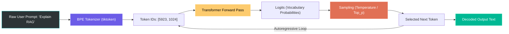

# 🎓 Phase 2: LLM APIs & Prompt Engineering — Complete Masterclass

Welcome to **Phase 2** of your journey to becoming a job-ready **AI Engineer**!

In [Phase 1](file:///Users/jashan/Desktop/AI%20Engenier/01-python-ai-foundations/README.md), you mastered the engineering plumbing: asynchronous programming, Pydantic v2 data models, and resilient retry architectures. 

Now in **Phase 2**, we interface directly with the models themselves. As an AI Engineer, you must know how foundation models (OpenAI GPT-4o, Anthropic Claude 3.5 Sonnet, Google Gemini) process language, how sampling hyperparameters shape their outputs, and how to use advanced prompt engineering to turn non-deterministic models into predictable, production-grade systems.

---

## 📑 Table of Contents
1. [How to Run and Test This Project by Yourself](#-how-to-run-and-test-this-project-by-yourself)
2. [LLM Mechanics: From Strings to Probabilities](#-llm-mechanics-from-strings-to-probabilities)
   - [What is a Token? (BPE Tokenization)](#what-is-a-token-bpe-tokenization)
   - [The Autoregressive Generation Loop](#the-autoregressive-generation-loop)
3. [Sampling Hyperparameters Decoded](#-sampling-hyperparameters-decoded)
   - [Temperature (Entropy Control)](#temperature-entropy-control)
   - [Top_p / Nucleus Sampling](#top_p-nucleus-sampling)
   - [Max Tokens & Penalties](#max-tokens--penalties)
4. [The 6 Core Prompt Engineering Techniques](#-the-6-core-prompt-engineering-techniques)
   - [1. Zero-Shot Prompting](#1-zero-shot-prompting)
   - [2. Few-Shot In-Context Learning](#2-few-shot-in-context-learning)
   - [3. Chain-of-Thought (CoT) Reasoning](#3-chain-of-thought-cot-reasoning)
   - [4. Persona & Role Conditioning](#4-persona--role-conditioning)
   - [5. Structural Delimiters & Grounding](#5-structural-delimiters--grounding)
   - [6. Native Structured Outputs (JSON Schema)](#6-native-structured-outputs-json-schema)
5. [Real-Time Token Streaming Mechanics (SSE)](#-real-time-token-streaming-mechanics-sse)
6. [Deep Code Walkthrough](#-deep-code-walkthrough)
   - [models.py — Structured Schema Definitions](#1-modelspy--structured-schema-definitions)
   - [prompt_templates.py — Production Prompt Builders](#2-prompt_templatespy--production-prompt-builders)
   - [providers.py — Multi-Provider Abstraction Layer](#3-providerspy--multi-provider-abstraction-layer)
   - [main.py — The Masterclass Showcase CLI](#4-mainpy--the-masterclass-showcase-cli)
   - [test_project.py — Automated Test Suite](#5-test_projectpy--automated-test-suite)
7. [Hands-On Experiments: Break and Learn](#-hands-on-experiments-break-and-learn)
8. [Senior AI Engineer Interview Prep: 5 Essential Questions](#-senior-ai-engineer-interview-prep-5-essential-questions)

---

## 💻 How to Run and Test This Project by Yourself

Everything in Phase 2 works **100% offline out-of-the-box** using our high-fidelity `MockLLMProvider` (zero API keys needed and zero cost). You can also add your real OpenAI or Anthropic API keys in `.env` whenever you want!

### Step 1: Open Terminal in the Project Root
```bash
cd "/Users/jashan/Desktop/AI Engenier"
```

### Step 2: Activate Your Virtual Environment
```bash
source .venv/bin/activate
```
*(Verify that `(.venv)` appears on the left of your terminal prompt).*

### Step 3: Run the Masterclass CLI Demo
Navigate into the Phase 2 project and execute `main.py`:
```bash
cd 02-llm-apis-prompt-engineering/project
python main.py
```

**What you will see in your terminal:**
1. **The Prompt Engineering Arena**: Zero-Shot vs Few-Shot vs Chain-of-Thought on the same challenge with token & cost breakdowns.
2. **Temperature & Sampling Lab**: Output differences across `temperature=0.0`, `0.7`, and `1.4`.
3. **Structured Output Article Generator**: A complete technical article validated through Pydantic with nested sections, reading time, and SEO metadata.
4. **Real-Time Token Streamer**: Live token-by-token terminal streaming with live token counter and USD cost meter.
5. **BPE Tokenizer & Multi-Model Pricing Matrix**: Cost projections across GPT-4o, GPT-4o-mini, Claude 3.5 Sonnet, Claude 3 Haiku, Gemini 1.5 Flash, and Gemini 1.5 Pro.

### Step 4: Run the Automated Unit Tests
```bash
pytest test_project.py -v
```
You will see **11 tests pass with green checks** (`PASSED`).

---

## 🧠 LLM Mechanics: From Strings to Probabilities



### What is a Token? (BPE Tokenization)
Large Language Models **do not read English letters or words**. They process numerical chunks called **tokens**.

- Models use **Byte Pair Encoding (BPE)**: A compression algorithm that merges frequently co-occurring character pairs into single token IDs.
- In English:
  - Common words are usually **1 token** (e.g. `"apple"`, `"python"`).
  - Punctuation, capitalization, and spaces count as tokens (e.g. `" Hello"` vs `"Hello"`).
  - Code, complex math, or non-English languages consume **more tokens per word** (e.g. `"asyncio.gather"` might be 4-5 tokens).
- **Rule of Thumb**: **1 token ≈ 4 characters** or **0.75 words** in typical English text.

### The Autoregressive Generation Loop
LLMs are **autoregressive**: they generate text one single token at a time.
1. The model receives input tokens $T_1, T_2, \dots, T_n$.
2. It outputs raw numerical scores (called **logits**) across its entire vocabulary (~100,000 to 200,000 possible tokens).
3. The logits are converted to a probability distribution using the **Softmax** function.
4. Your sampling parameters (Temperature, Top_p) pick one token from that distribution.
5. That new token is appended to the input, and the cycle repeats until a `<|endoftext|>` stop token is reached or `max_tokens` is hit.

---

## 🎛️ Sampling Hyperparameters Decoded

### Temperature (Entropy Control)
Mathematically, logits $z_i$ are divided by temperature $T$ before the softmax:
$$P(T_i) = \frac{\exp(z_i / T)}{\sum_j \exp(z_j / T)}$$

| Temperature | Logit Distribution Shape | Behavior | Best Used For |
|---|---|---|---|
| **0.0 (Greedy)** | Spikes into a single sharp peak | **Deterministic**: Always chooses the absolute highest-probability token. | Code generation, math, SQL queries, JSON schema extraction. |
| **0.5 – 0.7** | Smooth, balanced curve | **Balanced**: Selects likely tokens with natural, fluent vocabulary variation. | Technical writing, customer support, summaries, Q&A. |
| **1.2 – 1.6** | Flattens the curve toward uniform | **Creative / High Entropy**: Unlikely words have higher odds of being picked. | Brainstorming taglines, poetry, creative fiction. |

### Top_p (Nucleus Sampling)
Instead of considering all 100,000 tokens in the vocabulary, Top_p cuts off the long tail of low-probability words:
- `top_p = 0.9` means: Sort tokens by probability and only consider the smallest subset whose cumulative probability adds up to 90%. Throw the other 10% away.
- **Critical Production Rule**: Alter **Temperature** OR **Top_p**, but **never both simultaneously**. If you tune both, you create unpredictable compounding effects that make debugging output quality impossible.

### Max Tokens & Penalties
- **`max_tokens`**: The maximum number of tokens the model is allowed to generate in its *response* (does not include your prompt). Always set this in production to prevent runaway costs if a model gets stuck in a loop.
- **`frequency_penalty`** (-2.0 to 2.0): Penalizes tokens based on how many times they have already appeared in the output. Reduces repetitive phrasing.
- **`presence_penalty`** (-2.0 to 2.0): Penalizes tokens if they have appeared at all. Encourages the model to transition to new topics.

---

## 🎯 The 6 Core Prompt Engineering Techniques

### 1. Zero-Shot Prompting
Giving direct instructions with no prior examples.
- **When to use**: Standard tasks where the model already has deep pre-trained knowledge (e.g. "Translate this to French", "Summarize this paragraph in 3 bullets").
- **Best Practice**: Use explicit structural delimiters and define output format requirements.

### 2. Few-Shot In-Context Learning
Providing 2 to 4 high-quality input-output demonstrations before the user prompt.
- **Why it works**: Foundation models are pattern-matching engines. Demonstrations show the model the exact tone, schema, level of detail, and boundary conditions you expect without requiring model fine-tuning.
- **Production Tip**: Ensure exemplars cover edge cases (e.g., how to respond when data is missing or ambiguous).

### 3. Chain-of-Thought (CoT) Reasoning
Instructing the model to write out its internal reasoning steps before stating its final conclusion.
- **Why it works**: Because LLMs predict token-by-token, if you ask for the final answer immediately, the model must predict the answer in a single forward pass without "thinking". By forcing it to output reasoning tokens into its context first, the transformer's attention heads attend to its own reasoning to derive the answer!
- **Prompt Formula**: Use explicit XML scratchpads:
  ```
  1. Break down your reasoning step-by-step inside <thinking>...</thinking>.
  2. Provide your final conclusion inside <final_answer>...</final_answer>.
  ```

### 4. Persona & Role Conditioning
Conditioning the `system` prompt with a specific identity, perspective, and constraints.
- **Why it works**: Narrows the model's vast probability distribution toward the specific vocabulary, tone, and rigor of a domain expert (e.g. "Staff Reliability Architect" vs "Elementary School Teacher").

### 5. Structural Delimiters & Grounding
Using clear markdown fences (`###`, `"""`, `<context>...</context>`) to separate instructions from user-provided data.
- **Security Bonus**: Delimiters prevent **Prompt Injection** attacks, where malicious user text tries to hijack system instructions.

### 6. Native Structured Outputs (JSON Schema)
Modern frontier models (OpenAI, Claude, Gemini) support native structured outputs:
- Instead of hoping the model outputs valid JSON and using regex to extract it, the API constrains the model's token decoding mask to **only permit tokens that satisfy the JSON schema** derived from your Pydantic model!
- **Result**: **0% JSON parsing failures in production**.

---

## 🌊 Real-Time Token Streaming Mechanics (SSE)

In production AI applications, waiting 5 to 15 seconds for a complete answer causes users to abandon the app.

### How Streaming Works:
1. When you pass `stream=True`, the HTTP connection uses **Server-Sent Events (SSE)**.
2. The model generates token #1 and sends it across the wire immediately as a tiny chunk (`data: {"choices":[{"delta":{"content":"Hello"}}]}`).
3. The Python client uses an async generator (`async for chunk in stream:`) to yield each text fragment instantly.
4. **Time-to-First-Token (TTFT)** drops from 6,000ms to ~200ms!

---

## 🔍 Deep Code Walkthrough

Explore the codebase in [02-llm-apis-prompt-engineering/project/](file:///Users/jashan/Desktop/AI%20Engenier/02-llm-apis-prompt-engineering/project/):

### 1. `models.py` — Structured Schema Definitions
Open [models.py](file:///Users/jashan/Desktop/AI%20Engenier/02-llm-apis-prompt-engineering/project/models.py).
- `GeneratedArticle`: The comprehensive target schema with title, slug, summary, sections, tags, and reading time.
- `ArticleSection`: Nested model with headings and key takeaway bullet points.
- `TokenCostBreakdown`: Automatically matches model families (`gpt-4o`, `gpt-4o-mini`, `claude-3-5-sonnet`, `gemini-1.5-flash`) and calculates micro-cent USD costs.

### 2. `prompt_templates.py` — Production Prompt Builders
Open [prompt_templates.py](file:///Users/jashan/Desktop/AI%20Engenier/02-llm-apis-prompt-engineering/project/prompt_templates.py).
- `build_zero_shot_prompt()`: Clear delimiters with task criteria.
- `build_few_shot_prompt()`: Uses `FEW_SHOT_EXEMPLARS` demonstrating input-output formatting.
- `build_chain_of_thought_prompt()`: Enforces `<thinking>` scratchpads and `<final_answer>` tags.
- `build_persona_prompt()`: Injects system-level role conditioning.

### 3. `providers.py` — Multi-Provider Abstraction Layer
Open [providers.py](file:///Users/jashan/Desktop/AI%20Engenier/02-llm-apis-prompt-engineering/project/providers.py).
- `BaseLLMProvider`: Abstract contract requiring `generate_completion`, `generate_structured_article`, and `stream_completion`.
- `OpenAIProvider`: Implements `AsyncOpenAI`, native `beta.chat.completions.parse()`, and streaming.
- `AnthropicProvider`: Implements `AsyncAnthropic` messages streaming and tool-use schema parsing.
- `MockLLMProvider`: High-fidelity simulator enabling full testing with zero API keys.
- `get_provider()`: Auto-detects configured API keys or falls back to Mock mode gracefully.

### 4. `main.py` — The Masterclass Showcase CLI
Open [main.py](file:///Users/jashan/Desktop/AI%20Engenier/02-llm-apis-prompt-engineering/project/main.py).
- Runs 5 live demos: Prompt Arena, Sampling Lab, Structured Article Generator, Live Token Streamer, and BPE Cost Matrix.

### 5. `test_project.py` — Automated Test Suite
Open [test_project.py](file:///Users/jashan/Desktop/AI%20Engenier/02-llm-apis-prompt-engineering/project/test_project.py).
- 11 unit tests covering model validation, prompt formatting, tiktoken BPE counting, and provider streaming.

---

## 🧪 Hands-On Experiments: Break and Learn

Try these 3 experiments in your editor to see LLM mechanics firsthand:

### Experiment 1: Alter the Temperature in `main.py`
1. Open [main.py](file:///Users/jashan/Desktop/AI%20Engenier/02-llm-apis-prompt-engineering/project/main.py#L90).
2. Change the temperature array from `[0.0, 0.7, 1.4]` to `[0.0, 0.2, 1.8]`.
3. Run `python main.py`.
4. **Observe**: At 1.8, observe the extreme shift in randomness and expressive phrasing.

### Experiment 2: Break Pydantic Validation on Purpose
1. Open [models.py](file:///Users/jashan/Desktop/AI%20Engenier/02-llm-apis-prompt-engineering/project/models.py#L42).
2. Notice that `summary` requires `min_length=20`.
3. In [test_project.py](file:///Users/jashan/Desktop/AI%20Engenier/02-llm-apis-prompt-engineering/project/test_project.py#L65), observe how Pydantic safely prevents bad LLM responses from reaching downstream code.

### Experiment 3: Count Tokens with `tiktoken`
1. Run this quick command in your terminal:
   ```bash
   python -c "import tiktoken; enc = tiktoken.get_encoding('cl100k_base'); print(enc.encode('Hello, world! AI Engineer.'))"
   ```
2. **Observe**: See the actual integer token IDs that GPT-4o processes!

---

## 💼 Senior AI Engineer Interview Prep: 5 Essential Questions

#### Q1: What is the difference between Temperature and Top_p, and why shouldn't you tune both?
> **Answer**: Temperature scales the logits before softmax, globally smoothing or sharpening the probability distribution across all vocabulary tokens. Top_p (nucleus sampling) truncates the distribution, only sampling from the smallest set of tokens whose cumulative probability reaches $p$. Tuning both simultaneously causes compounding non-linear distortion, making it impossible to attribute output variance to either parameter.

#### Q2: Why does Chain-of-Thought (CoT) prompting improve performance on reasoning tasks?
> **Answer**: Transformers generate text autoregressively. When forced to answer immediately, the model must predict the solution in a single forward pass without computation time. By having the model output intermediate reasoning tokens into the context window, subsequent tokens attend to those generated reasoning steps via self-attention, effectively giving the model a dynamic computational scratchpad.

#### Q3: How do native Structured Outputs (like OpenAI's `parse` or JSON Schema mode) differ from standard prompt instructions?
> **Answer**: Prompt instructions ("Return valid JSON") rely on prompt following, which fails on complex schemas or edge cases. Native Structured Outputs use **constrained decoding**: during sampling, the API modifies the model's logit mask at each step to assign a probability of zero to any token that would violate the context-free grammar of the provided JSON Schema. This guarantees 100% syntactically valid JSON matching your Pydantic model.

#### Q4: What is Time-to-First-Token (TTFT) and why is it crucial in streaming architectures?
> **Answer**: TTFT measures the latency from when the user submits a prompt until the client receives the first generated token. While Total Generation Time depends on response length, TTFT determines perceived responsiveness. Streaming responses via Server-Sent Events (SSE) allows TTFT to remain in the 200–400ms range even if the full response takes 10 seconds to generate.

#### Q5: How do you optimize token costs in an enterprise AI application?
> **Answer**:
> 1. **Model Routing**: Route simple classification and extraction tasks to small, fast models (`gpt-4o-mini`, `gemini-1.5-flash`) and reserve frontier models (`claude-3-5-sonnet`, `gpt-4o`) for complex synthesis.
> 2. **Prompt Optimization**: Strip unnecessary filler from system prompts and use concise few-shot examples.
> 3. **Semantic Caching**: Store prompt embeddings in a vector database (e.g. Redis/Chroma) to return cached responses for semantically identical queries.
> 4. **Prompt Caching**: Leverage native provider prompt caching (OpenAI/Anthropic) for large static system instructions and few-shot exemplars.
