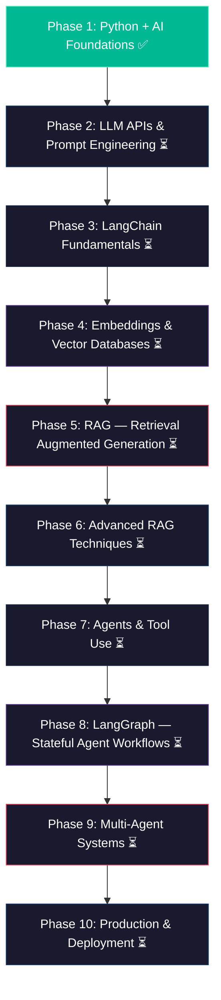

# 🚀 AI Engineer Mastery Roadmap — From Zero to Job-Ready

[](https://www.python.org/)
[](https://www.langchain.com/)
[](https://langchain-ai.github.io/langgraph/)
[](https://opensource.org/licenses/MIT)
[]()

A comprehensive, production-grade, project-driven learning repository to master AI Engineering from scratch. Each module contains end-to-end working projects, concept deep-dives, cheat sheets, and practical challenges.

---

## 🗺️ Learning Roadmap



---

## 📋 Curriculum & Phase Breakdown

| Phase | Topic | Status | Folder | Key Skills & Tech |
|---|---|:---:|---|---|
| **01** | [Python + AI Foundations](./01-python-ai-foundations/) | ✅ Completed | `01-python-ai-foundations/` | Asyncio, Pydantic, HTTPX, Type hints, Virtualenv |
| **02** | LLM APIs & Prompt Engineering | ⏳ In Progress | `02-llm-apis-prompt-engineering/` | OpenAI, Claude, Gemini, CoT, Structured Output |
| **03** | LangChain Fundamentals | ⏳ Upcoming | `03-langchain-fundamentals/` | LCEL, PromptTemplates, OutputParsers, Runnables |
| **04** | Embeddings & Vector Databases | ⏳ Upcoming | `04-embeddings-vector-databases/` | ChromaDB, FAISS, Pinecone, Cosine Similarity |
| **05** | RAG Fundamentals | ⏳ Upcoming | `05-rag-fundamentals/` | Ingestion, Chunking, Retrieval, Generation, LlamaIndex |
| **06** | Advanced RAG Techniques | ⏳ Upcoming | `06-advanced-rag/` | Hybrid Search (BM25), Re-ranking, HyDE, RAGAS Evals |
| **07** | Agents & Tool Use | ⏳ Upcoming | `07-agents-tool-use/` | ReAct Pattern, Function Calling, Custom Tools, Tavily |
| **08** | LangGraph Workflows | ⏳ Upcoming | `08-langgraph-workflows/` | StateGraph, Conditional Edges, Human-in-the-loop |
| **09** | Multi-Agent Systems | ⏳ Upcoming | `09-multi-agent-systems/` | CrewAI, Multi-Agent LangGraph, Task Delegation |
| **10** | Production & Deployment | ⏳ Upcoming | `10-production-deployment/` | FastAPI, Streamlit, Docker, LangSmith, Guardrails |

---

## 📂 Repository Structure

Each phase is self-contained with:
- `README.md` — In-depth architectural breakdown, diagrams, and theoretical concepts.
- `project/` — Fully functional, production-ready implementation.
- `exercises/` — Hands-on challenges to test your understanding.
- `cheatsheet.md` — Rapid reference guide for syntax, patterns, and best practices.

```text
AI-Engenier-Guide/
├── 01-python-ai-foundations/             # ✅ Phase 1
│   ├── README.md                         # Detailed guide
│   ├── cheatsheet.md                     # Cheat sheet
│   ├── exercises/
│   │   └── exercises.md
│   └── project/                          # Async Weather & News API Toolkit
│       ├── main.py
│       ├── models.py
│       ├── api_client.py
│       ├── test_project.py
│       ├── requirements.txt
│       └── .env.example
├── 02-llm-apis-prompt-engineering/       # ⏳ Phase 2
├── 03-langchain-fundamentals/            # ⏳ Phase 3
├── 04-embeddings-vector-databases/       # ⏳ Phase 4
├── 05-rag-fundamentals/                  # ⏳ Phase 5
├── 06-advanced-rag/                      # ⏳ Phase 6
├── 07-agents-tool-use/                   # ⏳ Phase 7
├── 08-langgraph-workflows/               # ⏳ Phase 8
├── 09-multi-agent-systems/               # ⏳ Phase 9
└── 10-production-deployment/             # ⏳ Phase 10
```

---

## 🛠️ Quick Start

### 1. Clone the Repository
```bash
git clone https://github.com/jashantiwari044/AI-Engenier-Guide.git
cd AI-Engenier-Guide
```

### 2. Set Up a Virtual Environment
```bash
python3 -m venv .venv
source .venv/bin/activate  # On Windows: .venv\Scripts\activate
```

### 3. Explore Phase 1 (Python & AI Foundations)
```bash
cd 01-python-ai-foundations/project
pip install -r requirements.txt
cp .env.example .env
python main.py
```

---

## 🎯 Job-Ready Skills Checklist

- [x] Modern Async Python, Type Hinting & Pydantic Data Modeling
- [ ] LLM API integration (OpenAI, Anthropic Claude, Google Gemini)
- [ ] Prompt engineering (Few-shot, Chain-of-Thought, ReAct, Structured Outputs)
- [ ] LangChain Expression Language (LCEL) & custom Runnables
- [ ] Vector database indexing, retrieval & hybrid search (BM25 + Dense)
- [ ] Production RAG pipelines with Citations, Evaluation (RAGAS)
- [ ] Autonomous Tool-Using Agents & Function Calling
- [ ] Stateful cyclic agent workflows with LangGraph & checkpoints
- [ ] Collaborative multi-agent teams with CrewAI
- [ ] Microservices with FastAPI, Uvicorn, Docker & LangSmith observability

---

## 📄 License

This repository is licensed under the [MIT License](LICENSE).
