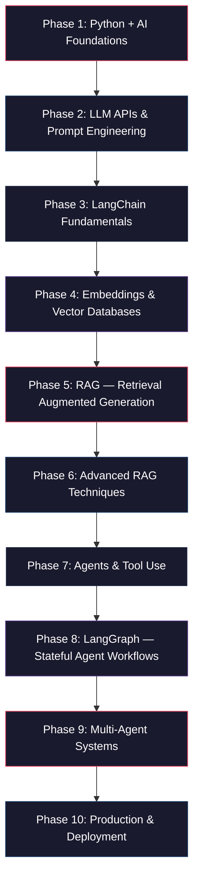
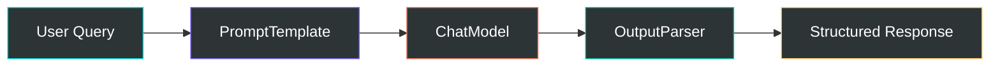
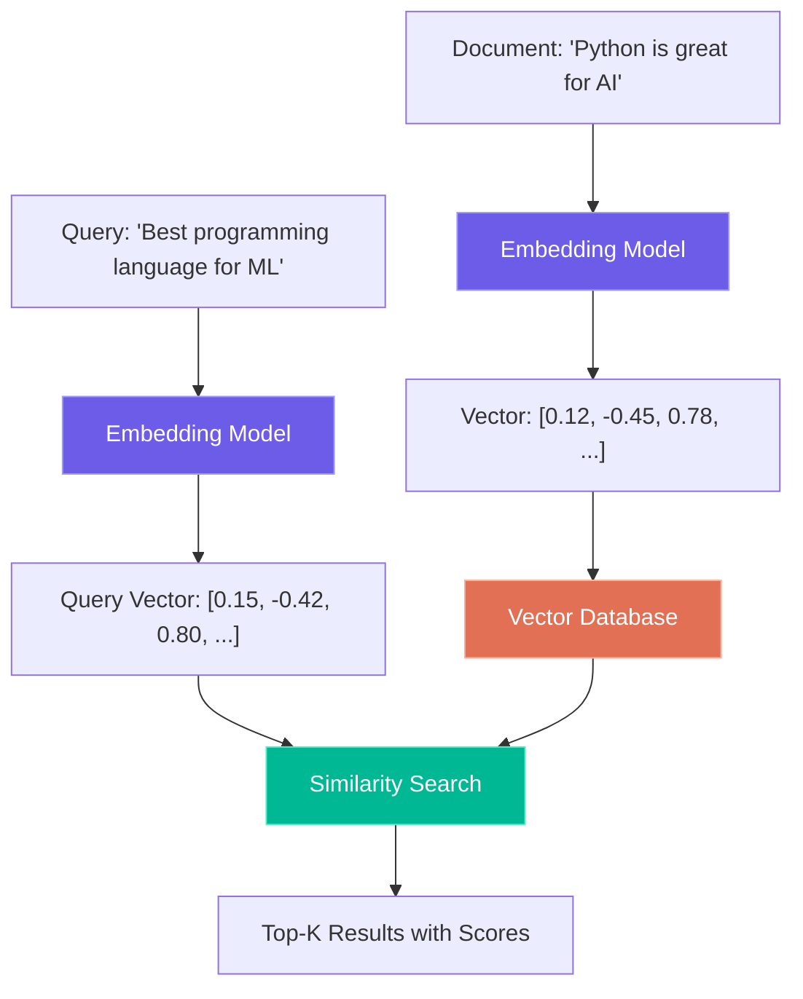
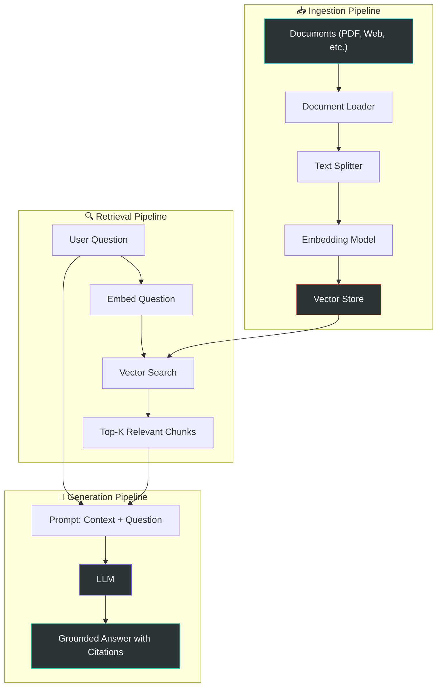
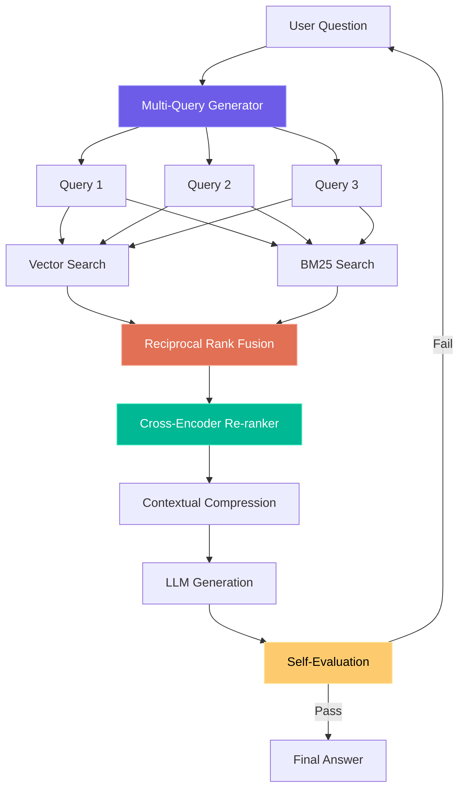
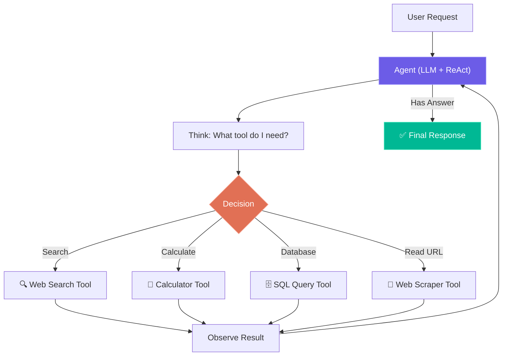
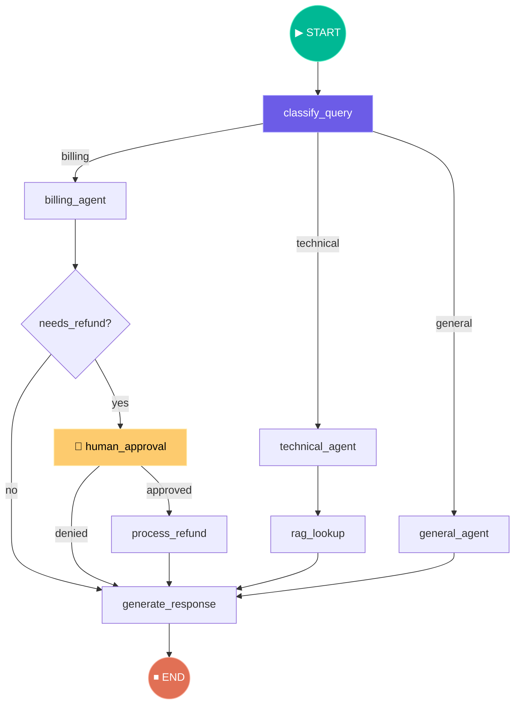
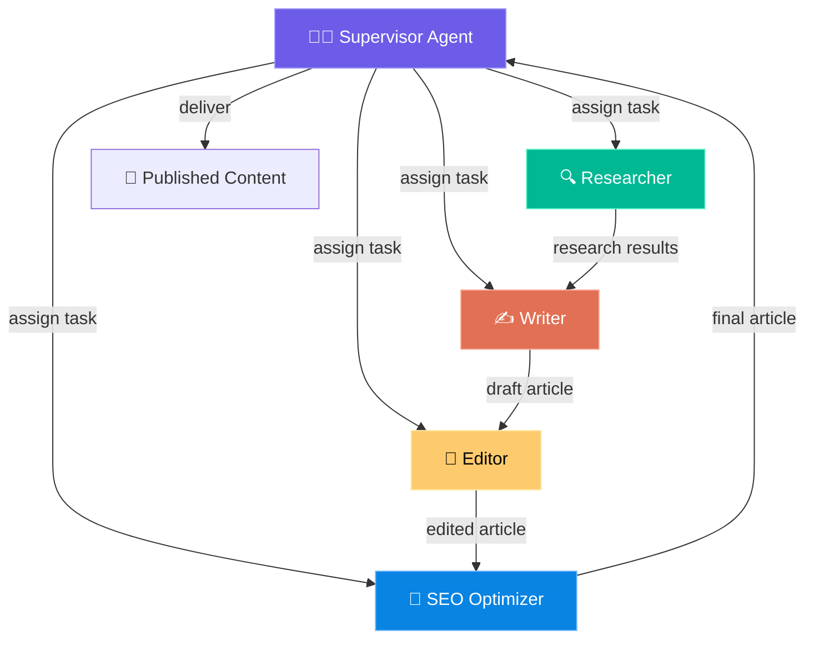

# 🚀 AI Engineer Mastery Roadmap — From Zero to Job-Ready

A complete, project-driven learning path to become a professional AI Engineer. Each phase builds on the previous one, with real projects, detailed explanations, and hands-on code.

> [!IMPORTANT]
> **This is a BIG plan.** It covers **10 Phases**, **20+ Projects**, and every major library/concept that top companies expect from AI Engineers. Each phase will have its own folder with:
> - `README.md` — Concept explanations (theory + diagrams)
> - `project/` — Fully working project code
> - `exercises/` — Practice challenges
> - `cheatsheet.md` — Quick reference

---

## 📋 What You'll Master

| Category | Technologies & Concepts |
|---|---|
| **LLM APIs** | OpenAI API, Anthropic API, Google Gemini API, Groq |
| **Frameworks** | LangChain, LangGraph, LlamaIndex, CrewAI |
| **Vector DBs** | ChromaDB, Pinecone, FAISS, Weaviate |
| **Embeddings** | OpenAI Embeddings, Sentence Transformers, HuggingFace |
| **RAG** | Naive RAG, Advanced RAG, Hybrid Search, Re-ranking |
| **Agents** | ReAct, Tool-Use, Multi-Agent, Autonomous Agents |
| **Memory** | Conversation Memory, Long-term Memory, MemGPT patterns |
| **Evaluation** | RAGAS, LangSmith, custom evals |
| **Deployment** | FastAPI, Streamlit, Docker, LangServe |
| **Advanced** | Fine-tuning, Guardrails, Prompt Engineering, Function Calling |

---

## 🗺️ Roadmap Overview



---

## Phase 1: Python + AI Foundations
**📁 Folder:** `01-python-ai-foundations/`
**⏱️ Duration:** 3-4 days
**🎯 Goal:** Solid Python skills specifically needed for AI engineering

### What You'll Learn
- Python async/await (critical for API calls)
- Working with JSON, APIs, and HTTP requests
- Environment variables and `.env` files for API keys
- Virtual environments and dependency management
- Type hints (used heavily in LangChain/LangGraph)
- Pydantic models (the backbone of AI frameworks)

### 🔨 Project: "API Toolkit"
Build a Python toolkit that:
- Makes async API calls to a public API (e.g., weather API)
- Parses JSON responses into Pydantic models
- Handles errors gracefully with retries
- Uses environment variables for configuration
- Includes proper logging

### Key Libraries
| Library | Why You Need It |
|---|---|
| `pydantic` | Data validation — used by LangChain, FastAPI, OpenAI SDK |
| `python-dotenv` | Manage API keys securely |
| `httpx` / `aiohttp` | Async HTTP requests |
| `asyncio` | Async programming for concurrent API calls |

---

## Phase 2: LLM APIs & Prompt Engineering
**📁 Folder:** `02-llm-apis-prompt-engineering/`
**⏱️ Duration:** 4-5 days
**🎯 Goal:** Master direct LLM API usage and prompt engineering techniques

### What You'll Learn
- OpenAI Chat Completions API (messages, roles, parameters)
- Temperature, top_p, max_tokens — what they do and when to tune them
- System prompts, few-shot prompting, chain-of-thought
- Structured output with JSON mode and function calling
- Token counting and cost optimization
- Streaming responses
- Anthropic and Google Gemini APIs (multi-provider skills)

### 🔨 Project: "Smart Content Generator"
Build a CLI tool that:
- Takes a topic and generates blog posts using OpenAI API
- Uses system prompts for different writing styles (professional, casual, technical)
- Implements few-shot prompting with examples
- Returns structured JSON output (title, sections, summary, tags)
- Streams the response in real-time to the terminal
- Tracks token usage and estimated cost
- Supports switching between OpenAI / Anthropic / Gemini

### Key Libraries
| Library | Why You Need It |
|---|---|
| `openai` | Official OpenAI Python SDK |
| `anthropic` | Anthropic Claude SDK |
| `google-genai` | Google Gemini SDK |
| `tiktoken` | Token counting for OpenAI models |

### Prompt Engineering Techniques Covered
1. **Zero-shot** — Direct instruction, no examples
2. **Few-shot** — Provide examples to guide output
3. **Chain-of-Thought (CoT)** — "Think step by step"
4. **ReAct** — Reasoning + Acting pattern
5. **Structured Output** — Force JSON/schema compliance

---

## Phase 3: LangChain Fundamentals
**📁 Folder:** `03-langchain-fundamentals/`
**⏱️ Duration:** 5-6 days
**🎯 Goal:** Master LangChain's core abstractions

### What You'll Learn
- Why LangChain exists (abstraction over LLM providers)
- Chat Models — `ChatOpenAI`, `ChatAnthropic`, `ChatGoogleGenerativeAI`
- Prompt Templates — `ChatPromptTemplate`, `MessagesPlaceholder`
- Output Parsers — `StrOutputParser`, `JsonOutputParser`, `PydanticOutputParser`
- LCEL (LangChain Expression Language) — the `|` pipe chain syntax
- Runnables — `RunnablePassthrough`, `RunnableLambda`, `RunnableParallel`
- Document Loaders — PDF, Web, CSV, etc.
- Text Splitters — `RecursiveCharacterTextSplitter`, `TokenTextSplitter`

### 🔨 Project: "Document Q&A Chain"
Build a system that:
- Loads documents (PDF, text, web pages) using LangChain loaders
- Splits them into chunks with different strategies
- Creates a prompt template for Q&A
- Chains components using LCEL: `prompt | llm | output_parser`
- Implements a `RunnableParallel` to process multiple questions simultaneously
- Formats output using Pydantic models

### Key Libraries
| Library | Why You Need It |
|---|---|
| `langchain` | Core framework |
| `langchain-openai` | OpenAI integration |
| `langchain-anthropic` | Anthropic integration |
| `langchain-community` | Community integrations (loaders, etc.) |
| `langchain-text-splitters` | Document chunking |

### Architecture Diagram


---

## Phase 4: Embeddings & Vector Databases
**📁 Folder:** `04-embeddings-vector-databases/`
**⏱️ Duration:** 4-5 days
**🎯 Goal:** Understand how text becomes vectors and how to search them

### What You'll Learn
- What are embeddings? (text → numbers that capture meaning)
- OpenAI Embeddings vs Sentence Transformers vs HuggingFace
- Cosine similarity, dot product — how vector search works
- ChromaDB — local vector database (great for learning)
- FAISS — Facebook's similarity search library
- Pinecone — managed cloud vector database
- Metadata filtering, hybrid search
- Chunking strategies and their impact on retrieval quality

### 🔨 Project: "Semantic Search Engine"
Build a semantic search engine that:
- Takes a folder of documents (PDFs, markdown files, code files)
- Generates embeddings using OpenAI Embeddings
- Stores them in ChromaDB with metadata (filename, date, type)
- Implements semantic search with similarity scores
- Adds metadata filtering (search within specific file types)
- Compares results: keyword search vs semantic search
- Visualizes embedding clusters using dimensionality reduction (UMAP/t-SNE)

### Key Libraries
| Library | Why You Need It |
|---|---|
| `chromadb` | Local vector database, perfect for development |
| `faiss-cpu` | High-performance vector search by Meta |
| `pinecone-client` | Cloud-managed vector DB for production |
| `sentence-transformers` | Open-source embeddings (no API costs) |
| `openai` | OpenAI's `text-embedding-3-small/large` |

### How Vector Search Works


---

## Phase 5: RAG — Retrieval Augmented Generation
**📁 Folder:** `05-rag-fundamentals/`
**⏱️ Duration:** 6-7 days
**🎯 Goal:** Build production-quality RAG systems

### What You'll Learn
- What is RAG and why it matters (LLMs + your data)
- The RAG pipeline: Ingest → Chunk → Embed → Store → Retrieve → Generate
- Naive RAG implementation from scratch
- RAG with LangChain (using `create_retrieval_chain`)
- RAG with LlamaIndex (alternative framework)
- Conversation-aware RAG (handling follow-up questions)
- Evaluation: Are the answers actually good? (faithfulness, relevance, context recall)

### 🔨 Project 1: "RAG Chatbot — Chat with Your Documents"
Build a chatbot that:
- Ingests a knowledge base (upload PDFs, websites, markdown)
- Chunks documents with `RecursiveCharacterTextSplitter`
- Stores embeddings in ChromaDB
- Retrieves relevant context for each question
- Generates answers grounded in the documents (with citations!)
- Maintains conversation history for follow-up questions
- Has a Streamlit UI for easy interaction

### 🔨 Project 2: "RAG with LlamaIndex"
Rebuild the same project using LlamaIndex to understand the differences:
- `VectorStoreIndex` vs LangChain's retrievers
- LlamaIndex's automatic chunking and indexing
- Query engines and response synthesizers

### Key Libraries
| Library | Why You Need It |
|---|---|
| `langchain` | RAG chain construction |
| `llama-index` | Alternative RAG framework by Jerry Liu |
| `chromadb` | Vector storage |
| `streamlit` | Quick UI for demos |
| `pypdf` | PDF parsing |
| `unstructured` | Advanced document parsing |

### RAG Architecture


---

## Phase 6: Advanced RAG Techniques
**📁 Folder:** `06-advanced-rag/`
**⏱️ Duration:** 6-7 days
**🎯 Goal:** Master the techniques that separate junior from senior AI engineers

### What You'll Learn
- **Hybrid Search** — Combine keyword (BM25) + semantic search
- **Re-ranking** — Use a cross-encoder to re-order retrieved results
- **HyDE** — Hypothetical Document Embeddings for better retrieval
- **Multi-Query RAG** — Generate multiple search queries from one question
- **Parent-Child Retrieval** — Retrieve small chunks, return larger context
- **Self-RAG** — LLM decides when to retrieve and evaluates its own output
- **Contextual Compression** — Extract only the relevant parts from retrieved docs
- **RAG Evaluation with RAGAS** — Measure faithfulness, relevance, recall

### 🔨 Project: "Advanced RAG Research Assistant"
Build a research assistant that:
- Implements all advanced RAG patterns as toggleable modules
- Uses hybrid search (BM25 + vector search)
- Re-ranks results with a cross-encoder model
- Generates multiple search queries for better coverage
- Evaluates answer quality using RAGAS metrics
- Provides a comparison dashboard showing naive vs advanced RAG performance
- Logs everything to LangSmith for debugging

### Key Libraries
| Library | Why You Need It |
|---|---|
| `rank_bm25` | BM25 keyword search |
| `sentence-transformers` | Cross-encoder re-ranking |
| `ragas` | RAG evaluation framework |
| `langsmith` | LLM observability and debugging |
| `cohere` | Cohere re-ranking API (alternative) |

### Advanced RAG Patterns


---

## Phase 7: Agents & Tool Use
**📁 Folder:** `07-agents-tool-use/`
**⏱️ Duration:** 5-6 days
**🎯 Goal:** Build AI agents that can take actions in the real world

### What You'll Learn
- What is an AI Agent? (LLM + Tools + Reasoning Loop)
- Function Calling / Tool Use (OpenAI, Anthropic)
- ReAct pattern — Reasoning + Acting
- Building custom tools (Python functions as tools)
- LangChain Agents — `create_tool_calling_agent`
- Tool types: API calls, web search, code execution, database queries
- Agent memory and conversation history
- Error handling and fallback strategies

### 🔨 Project: "AI Personal Assistant Agent"
Build an agent that can:
- Search the web (Tavily/SerpAPI integration)
- Read and summarize web pages
- Perform calculations
- Query a database (SQLite)
- Send notifications
- Maintain conversation context
- Explain its reasoning at each step (ReAct trace)

### Key Libraries
| Library | Why You Need It |
|---|---|
| `langchain` | Agent framework |
| `tavily-python` | AI-optimized web search |
| `langchain-community` | Community tools (Wikipedia, Arxiv, etc.) |
| `duckduckgo-search` | Free web search alternative |
| `sqlalchemy` | Database interaction |

### Agent Architecture


---

## Phase 8: LangGraph — Stateful Agent Workflows
**📁 Folder:** `08-langgraph-workflows/`
**⏱️ Duration:** 7-8 days
**🎯 Goal:** Master LangGraph for building complex, stateful AI applications

### What You'll Learn
- Why LangGraph? (When simple chains/agents aren't enough)
- State management with `TypedDict` and `Annotated` reducers
- Graph nodes, edges, and conditional routing
- `StateGraph` — defining the computation graph
- Conditional edges — branching logic based on LLM output
- Cycles and loops — agents that iterate until done
- Human-in-the-loop — pause for user approval
- Checkpointing — save and resume graph execution
- Subgraphs — composing complex workflows from simpler ones
- Streaming — real-time updates from graph execution

### 🔨 Project 1: "Customer Support Agent with Escalation"
Build a customer support system that:
- Classifies incoming queries (billing, technical, general)
- Routes to specialized sub-agents based on classification
- Has a RAG-powered knowledge base for each department
- Implements human-in-the-loop for sensitive operations (refunds)
- Saves conversation state with checkpointing
- Can resume interrupted conversations

### 🔨 Project 2: "Research Paper Analyzer"
Build a LangGraph workflow that:
- Takes a research topic
- Searches for relevant papers (Arxiv)
- Downloads and parses papers
- Extracts key findings, methodology, and results
- Generates a comparison table
- Writes a synthesis report
- Uses parallel nodes for concurrent processing
- Implements error recovery (retry failed downloads)

### Key Libraries
| Library | Why You Need It |
|---|---|
| `langgraph` | Stateful agent orchestration |
| `langgraph-checkpoint-sqlite` | Persistent state checkpointing |
| `langchain` | Core LLM abstractions |

### LangGraph Architecture


---

## Phase 9: Multi-Agent Systems
**📁 Folder:** `09-multi-agent-systems/`
**⏱️ Duration:** 6-7 days
**🎯 Goal:** Build systems where multiple AI agents collaborate

### What You'll Learn
- Multi-agent architectures: Supervisor, Hierarchical, Peer-to-Peer
- CrewAI — Define agents with roles, goals, and backstories
- Multi-agent with LangGraph — custom control flow
- Agent communication patterns
- Task delegation and result synthesis
- Shared memory between agents
- Error handling in multi-agent systems

### 🔨 Project 1: "AI Content Creation Crew" (CrewAI)
Build a content creation team:
- **Researcher Agent** — Searches the web for topic information
- **Writer Agent** — Writes the article based on research
- **Editor Agent** — Reviews and improves the article
- **SEO Agent** — Optimizes for search engines
- Agents collaborate using CrewAI's task delegation

### 🔨 Project 2: "Code Review Multi-Agent System" (LangGraph)
Build a code review pipeline:
- **Analyzer Agent** — Reads code and identifies issues
- **Security Agent** — Checks for security vulnerabilities
- **Performance Agent** — Suggests performance improvements
- **Reviewer Agent** — Synthesizes all feedback into a final review
- Built with LangGraph for precise control flow

### Key Libraries
| Library | Why You Need It |
|---|---|
| `crewai` | High-level multi-agent framework |
| `crewai-tools` | Pre-built tools for CrewAI agents |
| `langgraph` | Custom multi-agent orchestration |
| `autogen` | Microsoft's multi-agent framework (optional) |

### Multi-Agent Architecture


---

## Phase 10: Production & Deployment
**📁 Folder:** `10-production-deployment/`
**⏱️ Duration:** 6-7 days
**🎯 Goal:** Deploy AI applications like a professional

### What You'll Learn
- Building REST APIs with FastAPI for AI applications
- LangServe — Deploy LangChain chains as APIs
- Streamlit / Gradio — Rapid UI prototyping
- Docker containerization for AI apps
- Guardrails — Input/output validation for safety
- Caching — Reduce API costs with response caching
- Rate limiting and error handling
- Monitoring with LangSmith
- Cost optimization strategies
- Security best practices (API key management, input sanitization)

### 🔨 Capstone Project: "Full-Stack AI Platform"
Build a complete, deployable AI platform that combines everything:
- **FastAPI backend** with multiple endpoints:
  - `/chat` — Conversational AI with memory
  - `/rag` — Document Q&A with uploaded files
  - `/agents` — Task execution with tools
- **Streamlit frontend** for user interaction
- **RAG pipeline** with advanced retrieval
- **Agent system** with multiple tools
- **LangSmith integration** for monitoring
- **Docker deployment** with docker-compose
- **Guardrails** for input/output safety
- **Caching layer** for cost optimization

### Key Libraries
| Library | Why You Need It |
|---|---|
| `fastapi` | Production API framework |
| `uvicorn` | ASGI server for FastAPI |
| `langserve` | Deploy LangChain as REST API |
| `streamlit` | Frontend UI |
| `gradio` | Alternative frontend |
| `docker` | Containerization |
| `guardrails-ai` | Input/output validation |
| `redis` | Caching layer |
| `langsmith` | Observability and monitoring |

---

## 📊 Complete Library Reference

> [!TIP]
> This is your master reference of every library you'll use across all phases.

| Library | Category | Used In Phases | Install Command |
|---|---|---|---|
| `openai` | LLM Provider | 2, 3, 4, 5 | `pip install openai` |
| `anthropic` | LLM Provider | 2, 3 | `pip install anthropic` |
| `google-genai` | LLM Provider | 2, 3 | `pip install google-genai` |
| `langchain` | Framework | 3-10 | `pip install langchain` |
| `langchain-openai` | Integration | 3-10 | `pip install langchain-openai` |
| `langchain-anthropic` | Integration | 3-10 | `pip install langchain-anthropic` |
| `langchain-community` | Integrations | 3-10 | `pip install langchain-community` |
| `langgraph` | Agent Framework | 8, 9, 10 | `pip install langgraph` |
| `llama-index` | RAG Framework | 5 | `pip install llama-index` |
| `chromadb` | Vector DB | 4, 5, 6 | `pip install chromadb` |
| `faiss-cpu` | Vector Search | 4 | `pip install faiss-cpu` |
| `pinecone-client` | Cloud Vector DB | 4 | `pip install pinecone-client` |
| `crewai` | Multi-Agent | 9 | `pip install crewai` |
| `sentence-transformers` | Embeddings | 4, 6 | `pip install sentence-transformers` |
| `tiktoken` | Tokenization | 2, 3 | `pip install tiktoken` |
| `ragas` | RAG Evaluation | 6 | `pip install ragas` |
| `langsmith` | Observability | 6, 10 | `pip install langsmith` |
| `tavily-python` | Web Search | 7, 8 | `pip install tavily-python` |
| `fastapi` | API Framework | 10 | `pip install fastapi` |
| `streamlit` | UI Framework | 5, 10 | `pip install streamlit` |
| `pydantic` | Data Validation | 1-10 | `pip install pydantic` |
| `python-dotenv` | Config | 1-10 | `pip install python-dotenv` |

---

## 📂 Workspace Structure

```
AI Engenier/
├── 01-python-ai-foundations/
│   ├── README.md              # Concepts + explanations
│   ├── cheatsheet.md          # Quick reference
│   ├── project/               # API Toolkit project
│   │   ├── main.py
│   │   ├── models.py          # Pydantic models
│   │   ├── api_client.py      # Async API client
│   │   └── requirements.txt
│   └── exercises/             # Practice challenges
│       └── exercises.md
│
├── 02-llm-apis-prompt-engineering/
│   ├── README.md
│   ├── cheatsheet.md
│   ├── project/               # Smart Content Generator
│   └── exercises/
│
├── 03-langchain-fundamentals/
│   ├── README.md
│   ├── cheatsheet.md
│   ├── project/               # Document Q&A Chain
│   └── exercises/
│
├── 04-embeddings-vector-databases/
│   ├── README.md
│   ├── cheatsheet.md
│   ├── project/               # Semantic Search Engine
│   └── exercises/
│
├── 05-rag-fundamentals/
│   ├── README.md
│   ├── cheatsheet.md
│   ├── project/               # RAG Chatbot
│   ├── project-llamaindex/    # RAG with LlamaIndex
│   └── exercises/
│
├── 06-advanced-rag/
│   ├── README.md
│   ├── cheatsheet.md
│   ├── project/               # Advanced RAG Research Assistant
│   └── exercises/
│
├── 07-agents-tool-use/
│   ├── README.md
│   ├── cheatsheet.md
│   ├── project/               # AI Personal Assistant Agent
│   └── exercises/
│
├── 08-langgraph-workflows/
│   ├── README.md
│   ├── cheatsheet.md
│   ├── project-support/       # Customer Support Agent
│   ├── project-research/      # Research Paper Analyzer
│   └── exercises/
│
├── 09-multi-agent-systems/
│   ├── README.md
│   ├── cheatsheet.md
│   ├── project-crewai/        # Content Creation Crew
│   ├── project-langgraph/     # Code Review Multi-Agent
│   └── exercises/
│
└── 10-production-deployment/
    ├── README.md
    ├── cheatsheet.md
    ├── project/               # Full-Stack AI Platform (Capstone)
    │   ├── backend/           # FastAPI
    │   ├── frontend/          # Streamlit
    │   ├── docker-compose.yml
    │   └── requirements.txt
    └── exercises/
```

---

## 🎯 Job-Ready Skills Checklist

After completing all phases, you'll be able to confidently answer these interview topics:

- [x] Explain how LLMs work and their limitations
- [x] Design and implement RAG systems with advanced retrieval
- [x] Build AI agents that use tools and reason about actions
- [x] Create stateful workflows with LangGraph
- [x] Orchestrate multi-agent systems with CrewAI
- [x] Deploy AI applications with FastAPI and Docker
- [x] Evaluate and monitor AI systems in production
- [x] Optimize costs (caching, model selection, prompt optimization)
- [x] Implement guardrails and safety measures
- [x] Debug and troubleshoot LLM applications with LangSmith

---

## User Review Required

> [!IMPORTANT]
> **Please review and confirm:**
> 1. Are you comfortable with Python basics, or should Phase 1 be more detailed?
> 2. Do you have API keys for OpenAI / Anthropic / Google, or should I use free alternatives where possible?
> 3. Do you want me to start from Phase 1 and build everything sequentially?
> 4. Any specific area you want more depth in (e.g., more RAG projects, more agent projects)?

## Verification Plan

### For Each Phase
- Every project will be runnable with clear instructions
- Each README.md will explain concepts with diagrams and examples
- Code will include inline comments explaining every important line
- Exercises will test your understanding before moving to the next phase

### Final Validation
- The capstone project (Phase 10) integrates all concepts into one deployable application
- Run all projects end-to-end to verify they work correctly
